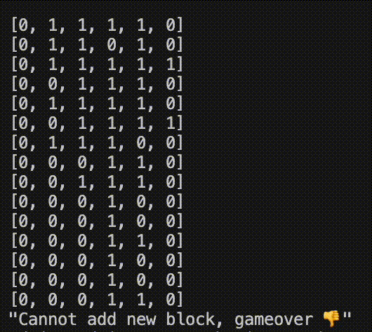

# ruby-tetris

Basic implementation of Tetris game in Ruby



## Limited features:

- Print grid every round
- Add falling piece (support multiple pieces)
- Clear row if the row is filled + Collapse the above rows
- Option to move left and right (or do nothing)

## How to run

```
$ ruby test.rb
```

### Options:

You can run it in "production" mode or not <i>(default: production mode)</i>

Turning on production mode means:

1. Slower intervals between each turn (easier to observe the transition)
2. Clearing the console, which creates an animation-ish transition between turns
3. Not show debugging messages and outputs

How: Uncomment `# production: false` in `test.rb` to run it in "debugging" mode

## Disclaimer:

- I haven’t tested it extensively, but it should work well unless there’s an unexpected edge case
- This program assumes the initial blocks passed in have valid starting coordinates and position.
